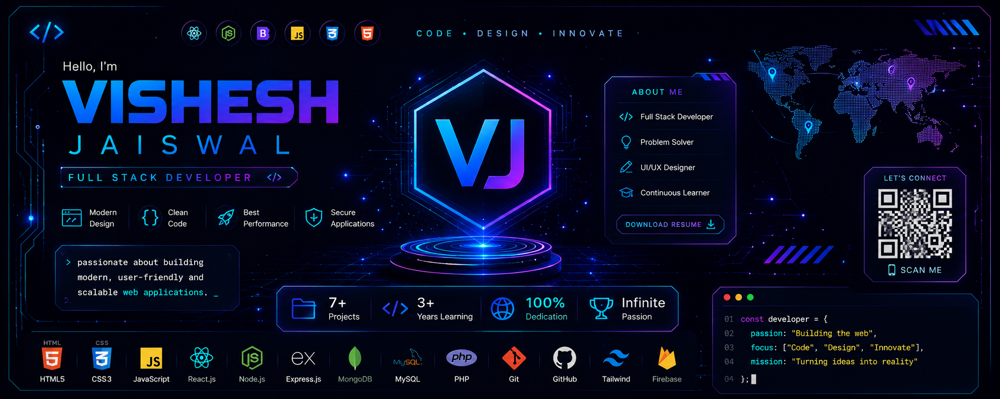

# 🚀 Vishesh Jaiswal – Premium Technology Resume

<div align="center">



# 👨‍💻 Vishesh Jaiswal

### Full Stack Developer • Frontend Engineer • UI/UX Designer

*A premium futuristic technology-themed interactive resume built with modern web technologies.*

[](https://client-conversion-hub--visheshjayaswal.replit.app/)
[](https://github.com/Code-With-Vishesh)
[](https://www.linkedin.com/in/codewithvishesh/)
[](https://codewithvishesh.vercel.app/)

</div>

---

# 📖 About

This project is a **next-generation interactive resume** designed with a futuristic developer dashboard aesthetic instead of a traditional CV.

It showcases my education, technical skills, projects, achievements, experience, social profiles, and developer journey in a premium UI/UX inspired by Apple, Vercel, GitHub, Stripe, and OpenAI.

---

# ✨ Features

- Premium Technology UI
- Glassmorphism
- Dark Theme
- Neon Effects
- Animated Background
- Floating Particles
- Responsive Design
- Mobile Friendly
- Interactive Cards
- Timeline Animation
- Skills Progress
- Project Showcase
- Contact Section
- Download Resume
- QR Code
- ATS Friendly
- SEO Optimized
- Fast Loading
- Accessibility Friendly

---

# 🎨 Design Theme

Inspired By

- Apple
- OpenAI
- GitHub
- Vercel
- Stripe
- Framer
- Linear

Color Palette

- Background → #050816
- Primary → #6C63FF
- Accent → #00E5FF
- Success → #00FFA3
- White Typography
- Glass Cards
- Gradient Borders

---

# 👨‍💻 Developer

## Vishesh Jaiswal

**Role**

- Full Stack Developer
- Frontend Developer
- UI/UX Designer

---

# 🎓 Education

## Jaipur National University

**Degree**

Bachelor of Computer Applications (BCA)

**Specialization**

Full Stack Development

**Program Partner**

ImagineXP

**Admission**

2024

**Current Year**

Third Year

---

# 🚀 Learning Journey

## 2024

- Started BCA
- Started Professional Programming Journey

## 2025

- HTML5
- CSS3
- JavaScript

## Present

- React.js
- Node.js
- PHP
- Full Stack Development
- UI/UX Design
- AI Integration
- Modern Web Development

---

# 💻 Technical Skills

## Frontend

- HTML5
- CSS3
- JavaScript ES6+
- React.js
- Three.js
- GSAP
- Responsive Design

## Backend

- Node.js
- Express.js
- PHP
- REST APIs

## Database

- MongoDB
- MySQL
- Firebase

## Tools

- Git
- GitHub
- VS Code
- Netlify
- Vercel
- Replit

---

# 🚀 Featured Projects

## 🌐 Client Conversion Hub

Professional Portfolio Website

🔗
https://client-conversion-hub--visheshjayaswal.replit.app/

Modern portfolio showcasing projects, UI design, developer profile and branding.

---

## 🖼 Image Explorer

🔗
https://imageexplorer1.netlify.app/

Beautiful image discovery platform with responsive interface and modern UI.

---

## ☁ SkyNova Weather

🔗
https://skynova-henna.vercel.app/

Modern weather application with responsive design and beautiful animations.

---

## 🍲 AI Recipe Finder

🔗
https://airecipefinderweb.netlify.app/

Recipe discovery application with AI-inspired user experience.

---

## 🎤 Voice Calculator

🔗
https://modern-voice-calculator.vercel.app/

Voice-controlled calculator with clean UI.

---

## ♟ Grandmaster Guild

🔗
https://grandmaster-guild.vercel.app/

Interactive Chess Game with modern gameplay experience.

---

## 📚 Code With Vishesh

🔗
https://codewithvishesh.vercel.app/

Educational platform for learning HTML, CSS, JavaScript, React and modern web development.

---

# 🏆 Achievements

- Built multiple production-ready projects.
- Published websites on Netlify, Vercel and Replit.
- Strong focus on modern UI/UX.
- Passionate Full Stack Developer.
- Continuous learner.
- Responsive Web Design specialist.

---

# 🌍 Languages

- English
- Hindi

---

# ❤️ Interests

- Full Stack Development
- Frontend Engineering
- UI/UX Design
- Artificial Intelligence
- Software Development
- Open Source
- Modern Web Technologies

---

# 📬 Contact

📧 Email

visheshjayaswal8910@gmail.com

📞 Phone

+91 7737204022

---

# 🌐 Social Links

### Portfolio

https://client-conversion-hub--visheshjayaswal.replit.app/

### GitHub

https://github.com/Code-With-Vishesh

### LinkedIn

https://www.linkedin.com/in/codewithvishesh/

### Instagram

https://www.instagram.com/code_with_vishesh/

### Website

https://codewithvishesh.vercel.app/

---

# 🛠 Built With

- HTML5
- CSS3
- JavaScript
- GSAP
- Three.js
- Font Awesome
- Google Fonts
- SVG
- Responsive Design

---

# 📂 Folder Structure

```
resume/
│
├── index.html
├── style.css
├── script.js
│
├── assets/
│   ├── profile.webp
│   ├── favicon.png
│   ├── resume.pdf
│   ├── banner.png
│   ├── icons/
│   ├── images/
│   └── backgrounds/
│
├── css/
│   ├── animations.css
│   ├── responsive.css
│   ├── variables.css
│   └── components.css
│
├── js/
│   ├── app.js
│   ├── animations.js
│   ├── particles.js
│   ├── cursor.js
│   ├── loader.js
│   └── scroll.js
│
└── README.md
```

---

# ⭐ Future Improvements

- AI Resume Assistant
- Dark/Light Mode
- Interactive Timeline
- 3D Animations
- Voice Navigation
- Multilingual Resume
- Download PDF
- Recruiter Mode
- Analytics Dashboard
- Portfolio Integration
- Live GitHub Statistics

---

<div align="center">

## ⭐ Thank You For Visiting ⭐

**Designed & Developed by Vishesh Jaiswal**

Made with ❤️ using Modern Web Technologies.

</div>
